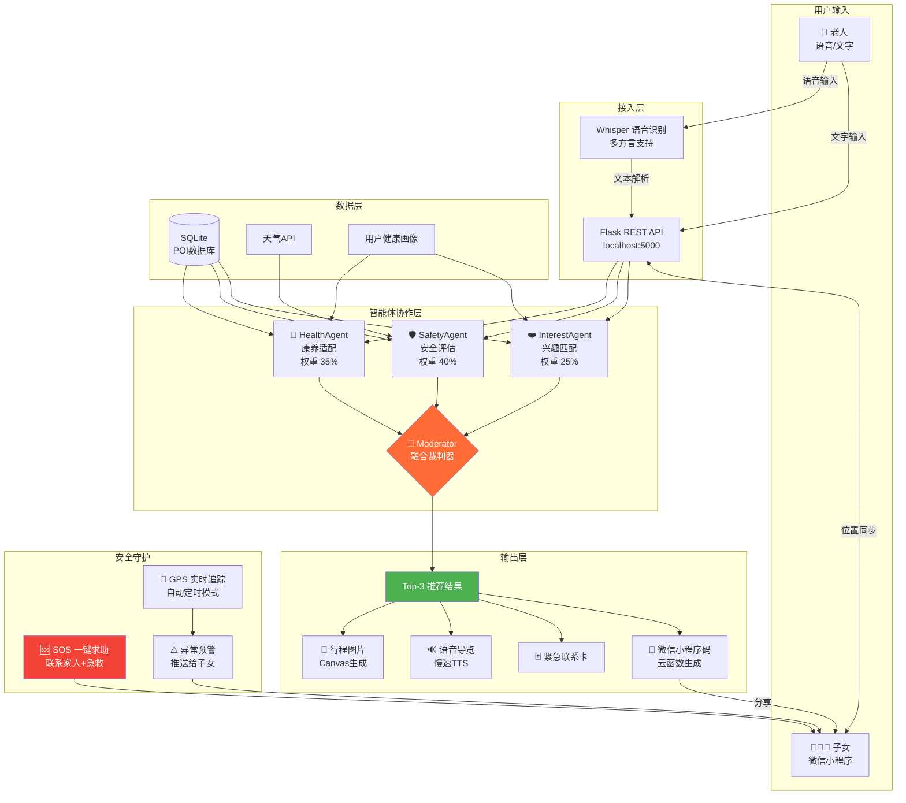

<div align="center">


# 🌟 SilverJourney AI

### 银发旅游智能伴侣

**首个完整覆盖「推荐 + 安全 + 适老化输出」全链路的银发旅游开源项目**

[](https://opensource.org/licenses/MIT)
[](https://www.python.org/downloads/)
[](https://streamlit.io)
[](VERSION.md)
[](https://github.com/adayu68/SilverJourneyAI/actions/workflows/ci.yml)
[](https://codecov.io/gh/adayu68/SilverJourneyAI)
[](https://developers.weixin.qq.com/)
[](CONTRIBUTING.md)
[](https://adayu68.github.io/SilverJourneyAI)
[](https://silverjourneyai-ebbajzza3o3rswyhswnqrf.streamlit.app/)
[](https://github.com/adayu68/SilverJourneyAI)

> 🎯 **实时语音交互 + 三智能体协作推荐 + 实时安全守护 + 一键出行包生成**
> = 让老人安心出行，让子女放心放手

[官网](https://adayu68.github.io/SilverJourneyAI) · [快速开始](#-快速开始) · [系统架构](#️-系统架构) · [功能演示](#-功能演示) · [技术栈](#-技术栈) · [贡献指南](#-贡献指南)

> **SilverJourney AI 是目前 GitHub 上唯一一个同时覆盖「适老化智能推荐 + 实时安全守护 + 子女联动小程序 + 出行包自动生成」完整闭环的银发旅游开源项目。**

</div>

---

## 🤔 为什么要做这个项目？

中国60岁以上老年人已超过 **2.8亿**，银发旅游市场规模突破万亿，但现有旅游平台的设计基本以年轻人为中心：

| 痛点 | 现状描述 | 影响 |
|------|---------|------|
| 🔤 **字体太小** | 普通 12-14px 字号，配色对比度低 | 老年人难以阅读，操作困难，放弃使用 |
| 🏥 **忽略健康需求** | 不考虑慢性病、行动能力、步行量 | 盲目推荐超出体力承受的目的地 |
| 😰 **安全缺乏保障** | 子女无法实时了解老人状态 | 独自出行风险高，家属焦虑 |
| 📄 **信息获取困难** | 无适合老年人的简洁出行材料 | 老人出行前准备不足，临场手忙脚乱 |
| 🎤 **交互门槛高** | 需要打字搜索，操作复杂 | 老年人使用障碍大，数字鸿沟严重 |
| 🗺️ **推荐不精准** | 通用算法无法理解银发群体特殊需求 | 推荐结果不适用，信任度低 |

**SilverJourney AI** 针对性解决上述每一个痛点，构建了完整的银发旅游智能服务体系。

---

## 🏆 核心亮点

### 与现有旅游产品的差异对比

| 功能维度 | 携程 / 飞猪 / 马蜂窝 | **SilverJourney AI** |
|---------|---------------------|----------------------|
| 界面适老化 | ❌ 普通字号 / 配色 | ✅ 18px+ 大字体 · 高对比度深色主题 · 大按钮 |
| 健康因素评估 | ❌ 无 | ✅ 慢性病 · 行动能力 · 台阶数 · 步行量全面评估 |
| 安全评估 | ❌ 无 | ✅ 医疗距离 · 实时天气 · 人流密度综合评分 |
| 子女实时联动 | ❌ 无 | ✅ GPS实时位置同步 · 异常自动预警推送 |
| 语音交互 | ⚠️ 仅普通话 / 标准口音 | ✅ Whisper 多方言支持（粤语/川话/闽南话） |
| 出行材料生成 | ❌ 无定制 | ✅ 大字版行程图片 · 慢速语音导览 · 紧急联系卡 |
| 推荐架构 | ⚠️ 单一协同过滤 | ✅ 三智能体协作 · 加权融合裁判器 |
| 安全过滤机制 | ❌ 无 | ✅ 安全评分 < 2星自动过滤，不推荐高风险目的地 |
| 开源程度 | ❌ 完全闭源 | ✅ 完全开源 · MIT协议 · 可二次开发 |
| 移动端 | ✅ 独立APP | ✅ 微信小程序（老人端 + 子女端） |

---

## 🏗️ 系统架构

### ASCII 总览图

```
┌─────────────────────────────────────────────────────────────────────────┐
│                              用 户 交 互 层                               │
│                                                                         │
│   👴 老人端（语音/文字）          👨‍👩‍👧 子女端（微信小程序）                  │
│   ┌──────────────────────┐      ┌─────────────────────────┐           │
│   │  Streamlit Web APP   │      │   WeChat Mini Program    │           │
│   │  · 大字体高对比度界面  │      │   · 实时位置查看          │           │
│   │  · Whisper语音识别    │      │   · 异常预警推送          │           │
│   │  · 健康画像设置        │      │   · 行程查看 & 分享       │           │
│   └────────────┬─────────┘      └──────────────┬──────────┘           │
└────────────────┼───────────────────────────────┼─────────────────────┘
                 │                               │
                 ▼                               ▼
┌─────────────────────────────────────────────────────────────────────────┐
│                           Flask REST API 层                              │
│              POST /api/recommend  ·  GET /api/pois  ·  POST /api/trip   │
└──────────────────────────────────┬──────────────────────────────────────┘
                                   │
                                   ▼
┌─────────────────────────────────────────────────────────────────────────┐
│                        智 能 体 协 作 层（核心引擎）                        │
│                                                                         │
│  ┌──────────────────┐  ┌──────────────────┐  ┌──────────────────┐      │
│  │  🏥 HealthAgent  │  │ 🛡️ SafetyAgent   │  │ ❤️ InterestAgent │      │
│  │                  │  │                  │  │                  │      │
│  │  · 步行量评估     │  │  · 医疗距离评估   │  │  · 标签相似度     │      │
│  │  · 台阶数适配     │  │  · 天气安全评分   │  │  · 季节偏好匹配   │      │
│  │  · 慢性病过滤     │  │  · 人流密度检测   │  │  · 历史行为学习   │      │
│  │  · 行动能力匹配   │  │  · 安全预警触发   │  │  · 旅行风格适配   │      │
│  └────────┬─────────┘  └────────┬─────────┘  └────────┬─────────┘      │
│           │    权重 35%          │    权重 40%          │    权重 25%     │
│           └──────────────────── ▼ ────────────────────┘                │
│                       ┌──────────────────────┐                         │
│                       │    🎯 Moderator       │                         │
│                       │      融合裁判器        │                         │
│                       │  · 安全<2星直接过滤    │                         │
│                       │  · 加权综合评分计算    │                         │
│                       │  · 输出 Top-3 + 理由  │                         │
│                       └──────────┬───────────┘                         │
└──────────────────────────────────┼──────────────────────────────────────┘
                                   │
                                   ▼
┌─────────────────────────────────────────────────────────────────────────┐
│                              数 据 服 务 层                               │
│                                                                         │
│   SQLite（适老化POI库 30+ 景点）  ·  实时天气API  ·  用户健康画像存储       │
│   覆盖城市：杭州·苏州·桂林·成都·北京·大理·丽江·三亚·西安·上海·厦门·黄山    │
└──────────────────────────────────┬──────────────────────────────────────┘
                                   │
                                   ▼
┌─────────────────────────────────────────────────────────────────────────┐
│                              输 出 生 成 层                               │
│                                                                         │
│   📄 行程图片       🔊 慢速语音导览     🃏 紧急联系卡     📱 小程序码分享    │
│   (Canvas 2D)     (edge-tts)         (ReportLab)      (云函数生成)       │
└─────────────────────────────────────────────────────────────────────────┘
```

### Mermaid 详细流程图



---

## 🚀 快速开始

### 环境要求

| 工具 | 版本要求 | 说明 |
|------|---------|------|
| Python | ≥ 3.9 | 核心运行环境 |
| pip | ≥ 22.0 | 包管理器 |
| 微信开发者工具 | 最新版 | 运行小程序（可选） |
| FFmpeg | 任意版本 | 启用 Whisper 语音识别时需要 |

### 方式一：一键启动（Streamlit Web版）

```bash
# 1. 克隆仓库
git clone https://github.com/adayu68/SilverJourneyAI.git
cd SilverJourneyAI

# 2. 安装依赖
pip install -r requirements.txt

# 3. 一键启动（自动初始化数据库并打开浏览器）
python start.py

# 或手动启动 Streamlit
streamlit run app.py --server.port 8501
```

启动成功后访问 👉 **http://localhost:8501**

### 方式二：同时启动 API 服务（微信小程序需要）

```bash
# 终端 1：启动 Web 界面
python start.py

# 终端 2：启动后端 API（微信小程序使用）
python api_server.py
# API 监听地址：http://localhost:5000
```

### 方式三：微信小程序接入

1. 下载并安装 [微信开发者工具](https://developers.weixin.qq.com/miniprogram/dev/devtools/download.html)
2. 打开开发者工具，选择 **导入项目**
3. 项目路径选择 `miniprogram/` 目录
4. 修改 `miniprogram/app.js` 中的 API 地址：

```javascript
// miniprogram/app.js
const API_BASE = 'http://localhost:5000'  // 改为您的服务器地址
```

5. 点击 **编译** 即可在模拟器中运行

### 环境变量配置（可选）

在项目根目录创建 `.env` 文件配置可选功能：

```env
# 高德地图 API Key（实时POI查询）
AMAP_API_KEY=your_amap_key_here

# OpenWeatherMap API Key（实时天气）
OPENWEATHER_API_KEY=your_weather_key_here

# 微信云开发环境ID（小程序码生成）
WX_CLOUD_ENV_ID=your-env-id

# 调试模式
DEBUG=false
```

---

## 🎬 功能演示

### 1. 适老化首页 — 语音/文字输入

> **场景**：王奶奶对着手机说："我想去一个不太累的地方，有山有水，最好附近有医院，我有高血压"

系统通过 **Whisper 多方言语音识别** 自动将语音转化为结构化查询参数，支持普通话、粤语、四川话等方言。

```
📝 识别结果：
  偏好标签   → ["山水", "休闲", "低强度"]
  健康条件   → 高血压（自动触发医疗距离过滤）
  行动能力   → 中等（步行量上限 5000步/天）
  出行方式   → 家庭陪同
```

> 📸 *截图占位 — `docs/screenshots/01_home_voice_input.png`*

---

### 2. 三智能体协作推荐引擎

输入老人的健康画像后，三个 Agent 并行评分，Moderator 裁判融合：

```
════════════════════════════════════════════════════
  🏆 推荐结果 #1：西湖景区（苏堤春晓区）— 杭州
════════════════════════════════════════════════════

  🏥 HealthAgent 康养指数：⭐⭐⭐⭐⭐ 4.5 分
     · 地势平坦，台阶仅12级
     · 12处休息凉亭，步行约4000步/天
     · 无障碍通道完善

  🛡️ SafetyAgent 安全评分：⭐⭐⭐⭐⭐ 4.8 分
     · 最近医院：杭州市第一人民医院，距离 1.2km
     · 当前天气：晴，气温 22°C，适宜出行
     · 人流密度：中等，不拥挤

  ❤️ InterestAgent 兴趣匹配：⭐⭐⭐⭐  4.2 分
     · 与「山水」「休闲散步」偏好高度吻合
     · 春季赏花，景色优美

  ────────────────────────────────────────────────
  🎯 Moderator 综合评分：4.55 / 5.0
  💬 推荐理由：强烈推荐！医疗配套优秀，步行量轻松
               可控，山水景色与您的兴趣完美契合。
════════════════════════════════════════════════════
```

> 📸 *截图占位 — `docs/screenshots/02_recommend_result.png`*

---

### 3. 一键生成出行包

确认景点后，系统自动生成完整出行材料：

| 出行包内容 | 技术实现 | 特点 |
|-----------|---------|------|
| 📄 **大字版行程图片** | Canvas 2D 绘制 | 18px+ 大字，高对比度，可保存相册 |
| 🔊 **慢速语音导览** | edge-tts TTS | 语速比正常慢 30%，关键信息重复 |
| 🃏 **紧急联系卡** | ReportLab PDF | 子女电话 · 最近医院 · 急救120 |
| 📱 **微信小程序码** | 云函数生成 | 子女扫码即可查看完整行程 |

> 📸 *截图占位 — `docs/screenshots/03_travel_package.png`*

---

### 4. 行程规划页

基于推荐景点自动生成按天分组的详细行程，包括：
- 每日景点游览顺序
- 预计步行量与休息建议
- 餐饮与住宿推荐
- 交通路线说明

> 📸 *截图占位 — `docs/screenshots/04_itinerary_page.png`*

---

### 5. 实时安全守护（子女端）

子女微信小程序实时接收老人位置与状态：

```
🗺️ 实时位置追踪
  ┌──────────────────────────────────┐
  │  📍 当前位置：西湖苏堤景区         │
  │  🕐 更新时间：2026-03-26 14:32    │
  │  📶 信号强度：强                  │
  │                                  │
  │  ⚡ 自动追踪：已开启（60秒/次）    │
  │  切换间隔：[30s] [1min✓] [3min] [5min]│
  └──────────────────────────────────┘

⚠️ 异常触发规则 → 自动推送到子女端
  位置偏离预定路线 >500m  → 即时预警
  突发健康事件（SOS）      → 同时联系急救和家人
  恶劣天气预警             → 建议改期提醒
  超过预计回程时间 >30min  → 关怀提醒
```

**SOS 一键求助**：大红色悬浮按钮，老人单击触发三件事：
1. 自动拨打 120 急救
2. 发送当前 GPS 坐标给子女
3. 导航至最近医院

> 📸 *截图占位 — `docs/screenshots/05_safety_page.png`*

---

## 🔧 技术栈

### 后端 / AI 层

| 技术 | 版本 | 用途 |
|------|------|------|
| **Python** | 3.9+ | 核心运行环境 |
| **Streamlit** | ≥1.32 | 适老化 Web 界面（大字体、高对比度主题） |
| **Flask** | ≥3.0 | RESTful API 服务 |
| **Flask-CORS** | ≥4.0 | 跨域支持（微信小程序调用） |
| **SQLAlchemy** | ≥2.0 | ORM 数据库访问层 |
| **SQLite** | 内置 | 轻量级本地数据库，零配置 |
| **ReportLab** | ≥4.0 | 大字版 PDF 行程单生成 |
| **qrcode + Pillow** | ≥7.4 / ≥10.0 | 微信分享二维码生成 |
| **python-dotenv** | ≥1.0 | 环境变量管理 |
| **OpenAI Whisper** | ≥20231117 | 多方言语音识别（可选，需 FFmpeg） |
| **edge-tts / pyttsx3** | — | 慢速语音导览 TTS（可选） |
| **requests** | ≥2.31 | 天气/地图等外部 API 调用 |

### 前端 / 移动端

| 技术 | 说明 |
|------|------|
| **微信小程序** | 原生 WXML/WXSS/JS，零框架依赖 |
| **Canvas 2D API** | 小程序端行程图片绘制 |
| **微信云开发** | 云函数生成小程序码、云存储托管 |
| **wx.startLocationUpdate** | 后台实时 GPS 追踪 |
| **i18n 框架** | 中文/英文双语，自动跟随系统语言 |
| **LazyCodeLoading** | 分包异步加载，主包体积 < 2MB |

### 适老化设计规范

| 规范 | 标准值 |
|------|--------|
| 最小字号 | 16px（推荐 18px+） |
| 最小点击区域 | 44×44px |
| 颜色对比度 | ≥ 4.5:1（WCAG AA 级） |
| 主题 | 深色高对比度（橙色 #ff6b35 主色调） |
| 语音识别超时 | 10秒（老人反应时间更长） |

---

## 📁 项目结构

```
SilverJourneyAI/
│
├── 📄 app.py                        # Streamlit 主应用（Web版入口）
├── 📄 api_server.py                 # Flask REST API 服务（小程序后端）
├── 📄 start.py                      # 一键启动脚本（初始化DB + 启动Web）
├── 📄 requirements.txt              # Python 依赖列表
├── 📄 README.md                     # 项目说明文档（本文件）
├── 📄 CHANGELOG.md                  # 版本变更记录
├── 📄 VERSION.md                    # 版本号管理
│
├── 🐍 silverjourney/                # 核心 Python 业务包
│   │
│   ├── agents/                      # 三智能体协作引擎
│   │   ├── base_agent.py            # Agent 抽象基类（统一接口规范）
│   │   ├── health_agent.py          # 🏥 康养适配 Agent
│   │   │                            #    输入：用户健康画像 + POI数据
│   │   │                            #    输出：康养指数(0-5) + 行程强度 + 健康建议
│   │   ├── safety_agent.py          # 🛡️ 安全评估 Agent
│   │   │                            #    输入：POI位置 + 实时天气 + 医疗数据
│   │   │                            #    输出：安全评分(0-5) + 风险提示
│   │   ├── interest_agent.py        # ❤️ 兴趣匹配 Agent
│   │   │                            #    输入：用户偏好标签 + POI标签
│   │   │                            #    输出：兴趣匹配度(0-5) + 匹配理由
│   │   └── moderator.py             # 🎯 融合裁判器
│   │                                #    加权融合(安全40%+康养35%+兴趣25%)
│   │                                #    安全<2星自动过滤，输出Top-K
│   │
│   ├── database/                    # 数据库层
│   │   ├── models.py                # SQLAlchemy ORM 模型定义
│   │   └── seed_data.py             # 适老化POI种子数据（30+景点）
│   │
│   ├── output/                      # 出行包生成
│   │   └── package_generator.py     # PDF/二维码/语音导览/紧急联系卡
│   │
│   ├── utils/                       # 工具函数
│   │   └── base_agent.py            # Agent工具基类
│   │
│   └── data/                        # 运行时数据（自动生成）
│       └── silverjourney.db         # SQLite 数据库文件
│
├── 📱 miniprogram/                  # 微信小程序
│   │
│   ├── app.js                       # 小程序全局配置（API地址/用户信息）
│   ├── app.json                     # 小程序入口配置（分包/权限/后台定位）
│   ├── app.wxss                     # 全局样式（适老化变量/高对比度主题）
│   │
│   ├── pages/                       # 主包页面（4个核心页面）
│   │   ├── home/                    # 🏠 首页
│   │   │   ├── home.js              #    语音输入/健康档案/偏好设置
│   │   │   ├── home.wxml            #    大字体高对比度布局
│   │   │   └── home.wxss            #    适老化样式
│   │   ├── recommend/               # 🎯 推荐结果页
│   │   │   ├── recommend.js         #    三智能体评分展示/出行包生成/分享
│   │   │   └── ...
│   │   ├── itinerary/               # 🗓️ 行程规划页
│   │   │   ├── itinerary.js         #    按天行程/Canvas图片导出/分享
│   │   │   └── ...
│   │   └── safety/                  # 🛡️ 安全守护页
│   │       ├── safety.js            #    GPS追踪/SOS/最近医院/子女联系
│   │       └── ...
│   │
│   ├── packageFeedback/             # 分包：用户反馈页
│   ├── packageDetail/               # 分包：POI详情页
│   │
│   ├── cloudfunctions/              # 微信云函数
│   │   └── generateQRCode/          # 生成小程序码（调用 openapi.wxacode）
│   │
│   ├── custom-tab-bar/              # 自定义底部导航栏
│   ├── i18n/                        # 国际化语言包（中文/英文）
│   └── utils/                       # 小程序工具函数（防抖/节流/格式化）
│
├── 🧪 tests/                        # 单元测试
│   ├── test_health_agent.py         # HealthAgent 测试用例
│   ├── test_safety_agent.py         # SafetyAgent 测试用例
│   ├── test_interest_agent.py       # InterestAgent 测试用例
│   └── test_moderator.py            # Moderator 融合裁判器测试
│
└── 📚 docs/                         # 文档
    └── screenshots/                 # 功能截图
```

---

## 🗺️ 开发路线图

### ✅ v1.0.0 — 正式版（2026-03-26）

- [x] 三智能体评分引擎（HealthAgent / SafetyAgent / InterestAgent + Moderator）
- [x] BaseAgent 抽象基类，统一 `assess()` / `score_to_stars()` / `batch_assess()` 接口
- [x] Streamlit 适老化 Web 界面（18px+ 大字体 · 高对比度 · 大按钮）
- [x] 语音输入模块（Whisper，支持多方言切换）
- [x] 适老化 POI 数据库（30+ 精选景点，覆盖 13 大热门城市）
- [x] Canvas 2D 行程图片生成（可保存相册）
- [x] 微信分享小程序码（云函数生成）
- [x] 微信小程序完整 4 页（首页/推荐/行程/安全）
- [x] GPS 实时追踪（后台定位 + 30s/1min/3min/5min 可调间隔）
- [x] SOS 一键求助（急救 + 子女通知 + 医院导航）
- [x] 多语言 i18n 框架（中文/英文）
- [x] 分包加载（LazyCodeLoading，主包 < 2MB）
- [x] 完整 pytest 单元测试套件
- [x] Flask API 服务（完整 RESTful 接口）

### 🚧 v1.1.0 — 数据强化（计划 2026 Q2）

- [ ] 高德地图实时 POI 查询接入
- [ ] OpenWeatherMap 实时天气数据接入
- [ ] 实时人流密度数据（景区开放 API）
- [ ] POI 数据扩充至 200+ 景点
- [ ] 城市扩展：广州、深圳、南京、武汉、重庆

### 📋 v1.2.0 — 体验升级（计划 2026 Q3）

- [ ] Whisper 语音识别本地部署教程
- [ ] 慢速 TTS 语音导览音频生成（edge-tts 集成）
- [ ] PDF 中文字体完善（reportlab CJK 字体嵌入）
- [ ] 健康画像系统（基于历史行程分析偏好）
- [ ] 离线地图支持（瓦片预下载）
- [ ] 微信小程序上架审核

### 🔮 v2.0.0 — 智能升级（计划 2026 Q4）

- [ ] 接入大语言模型（替代规则引擎），实现对话式推荐
- [ ] 实时道路状况与无障碍设施众包更新
- [ ] 老人端独立 APP（Android/iOS）
- [ ] 医院/急救点数据 GIS 精确整合
- [ ] 多城市线下伴游导览服务对接

---

## 🤝 贡献指南

欢迎所有形式的贡献！无论是报告 Bug、提交新功能、完善文档，还是为更多城市添加适老化 POI 数据。

### 贡献步骤

```bash
# Step 1：Fork 本仓库（点击右上角 Fork 按钮）

# Step 2：克隆到本地
git clone https://github.com/YOUR_USERNAME/SilverJourneyAI.git
cd SilverJourneyAI

# Step 3：创建特性分支（命名规范：feature/xxx 或 fix/xxx）
git checkout -b feature/add-guangzhou-pois

# Step 4：修改代码，运行测试确认无误
pip install -r requirements.txt
pytest tests/ -v

# Step 5：提交改动（遵循 Conventional Commits 规范）
git add .
git commit -m "feat: 添加广州20个适老化景点POI数据"

# Step 6：推送到您的 Fork
git push origin feature/add-guangzhou-pois

# Step 7：在 GitHub 上提交 Pull Request
#         描述您的改动内容和测试结果
```

### 贡献领域

| 领域 | 描述 | 难度 | 特别说明 |
|------|------|------|---------|
| 📍 **POI 数据** | 添加更多城市的适老化景点数据 | 🟢 低 | 参考 `silverjourney/database/seed_data.py` 格式 |
| 🐛 **Bug 修复** | 修复 Issues 中的已知问题 | 🟡 中 | 请附带测试用例 |
| 🌏 **方言支持** | 扩展 Whisper 方言识别范围 | 🟡 中 | 需要方言测试音频样本 |
| 🎨 **UI 优化** | 改进适老化界面设计 | 🟡 中 | 需满足适老化设计规范 |
| 📡 **API 集成** | 接入高德/天气等实时数据源 | 🔴 高 | 需提供 API Key 配置说明 |
| 🤖 **Agent 增强** | 改进三智能体评分算法 | 🔴 高 | 需提供效果对比数据 |
| 🌐 **多语言** | 新增语言翻译包（如粤语/繁中/日文） | 🟡 中 | 添加 `i18n/` 目录下语言文件 |

### 代码规范

```
✅ Python 代码遵循 PEP 8
✅ 提交信息使用 Conventional Commits 格式：
     feat:     新功能
     fix:      Bug 修复
     docs:     文档更新
     style:    代码格式调整（不影响功能）
     refactor: 代码重构
     test:     添加/修改测试
     chore:    构建/配置变更
✅ 新功能需附带单元测试（测试覆盖率 > 80%）
✅ 修改适老化 UI 需截图说明变化前后
```

### 提交 PR 前检查清单

```bash
# 1. 代码质量
pytest tests/ -v                          # 全部测试通过
python -m py_compile silverjourney/**/*.py  # 无语法错误

# 2. 代码风格（可选，推荐安装）
pip install flake8
flake8 silverjourney/ --max-line-length=100

# 3. 微信小程序（如修改了小程序代码）
# 在微信开发者工具中编译无报错
# 主流程在模拟器中正常运行
```

---

## 📊 适老化 POI 数据说明

当前内置适老化 POI 数据覆盖城市（持续更新中）：

> **杭州** · **苏州** · **桂林** · **成都** · **北京** · **大理** · **丽江** · **三亚** · **西安** · **上海** · **厦门** · **黄山** · **张家界**

每个 POI 包含以下适老化专属字段：

| 字段 | 类型 | 说明 |
|------|------|------|
| `has_wheelchair_access` | bool | 是否有无障碍通道 |
| `has_elevator` | bool | 是否有电梯 |
| `has_rest_area` | bool | 是否有休息区 |
| `rest_area_count` | int | 休息区/凉亭数量 |
| `estimated_daily_steps` | int | 预估每日步行量（步） |
| `stair_count` | int | 景区内台阶总数 |
| `nearest_hospital_km` | float | 最近医院距离（公里） |
| `nearest_hospital_name` | str | 最近医院名称 |
| `wellness_index` | float | 康养指数综合评分（0-5） |

---

## 📄 许可证

本项目采用 [MIT License](LICENSE) 开源许可证。

```
MIT License

Copyright (c) 2026 SilverJourney AI Contributors

Permission is hereby granted, free of charge, to any person obtaining a copy
of this software and associated documentation files (the "Software"), to deal
in the Software without restriction, including without limitation the rights
to use, copy, modify, merge, publish, distribute, sublicense, and/or sell
copies of the Software, and to permit persons to whom the Software is
furnished to do so, subject to the following conditions:

The above copyright notice and this permission notice shall be included in all
copies or substantial portions of the Software.

THE SOFTWARE IS PROVIDED "AS IS", WITHOUT WARRANTY OF ANY KIND, EXPRESS OR
IMPLIED, INCLUDING BUT NOT LIMITED TO THE WARRANTIES OF MERCHANTABILITY,
FITNESS FOR A PARTICULAR PURPOSE AND NONINFRINGEMENT. IN NO EVENT SHALL THE
AUTHORS OR COPYRIGHT HOLDERS BE LIABLE FOR ANY CLAIM, DAMAGES OR OTHER
LIABILITY, WHETHER IN AN ACTION OF CONTRACT, TORT OR OTHERWISE, ARISING FROM,
OUT OF OR IN CONNECTION WITH THE SOFTWARE OR THE USE OR OTHER DEALINGS IN THE
SOFTWARE.
```

---

## 🌟 Star 历史

如果这个项目对您有帮助，请给我们一个 ⭐ **Star**！

这将帮助更多人发现这个项目，让更多银发族受益。

---

<div align="center">

**用科技守护夕阳旅途 · 让每一位老人都能安心出行**

Made with ❤️ by SilverJourney AI Contributors

*SilverJourney AI — v1.0.0 · Released 2026-03-26*

</div>
